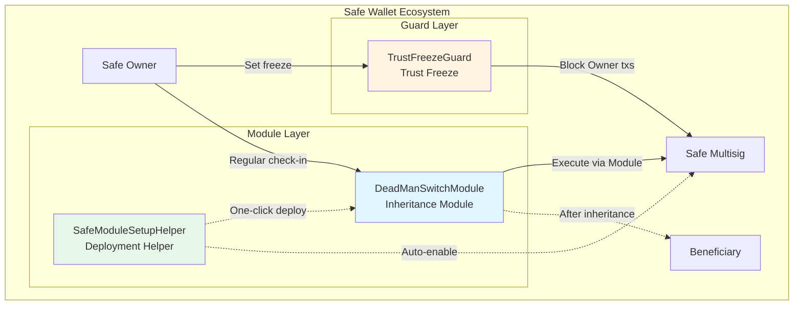

# FamilyKey Contract

<div align="center">

**Core smart contracts for decentralized crypto inheritance**

[](https://docs.soliditylang.org/)
[](https://book.getfoundry.sh/)
[](https://safe.global/)
[](https://zodiac.wiki/)
[](./LICENSE)

</div>

---

> **Language:** English | [中文](README.md)

---

## 📖 Overview

FamilyKey Contract is a decentralized asset inheritance solution built on Safe multisig wallets. It provides a secure and flexible inheritance pathway through Dead Man's Switch mechanisms and trust freeze functionality.

### Key Features

- 🔄 **Automated inheritance flow**: On-chain automation for heartbeat check-ins, expiry detection, challenge periods, and ownership transfer
- 🧩 **Modular architecture**: Built on the Zodiac framework, adhering to Safe ecosystem standards
- 🛡️ **Trust freeze functionality**: Freeze Owner operations via Guard mechanism while keeping modules operational
- ⚡ **One-click deployment**: Deploy and enable modules simultaneously during Safe creation via SafeModuleSetupHelper
- 🔐 **Multiple security layers**: Challenge period protection, state machine constraints, identity verification, permission isolation
- 🧪 **Comprehensive testing**: Foundry test coverage for complete inheritance scenarios and edge cases

### Use Cases

- **Personal asset inheritance**: Set beneficiaries and inheritance rules for personal crypto assets
- **Family trusts**: Implement long-term trust lockups with freeze functionality while maintaining emergency inheritance mechanisms
- **Enterprise asset management**: Configure multiple inheritance pathways and backup plans for corporate wallets

---

## 🧱 Architecture



### Architecture Explanation

1. **DeadManSwitchModule**: Implements heartbeat detection and ownership transfer logic
2. **SafeModuleSetupHelper**: Deploys and enables modules during Safe initialization via delegatecall
3. **TrustFreezeGuard**: Freezes Owner-initiated transactions while allowing Module execution

**Key Design Principles**:
- Modules execute via `execTransactionFromModule`, bypassing Guard checks
- Owner transactions via `execTransaction` are subject to Guard restrictions
- During trust period, Owner cannot operate, but inheritance functionality remains active

---

## 🧩 Contract Modules

### Core Contracts

| Contract | Description | Key Functions | File |
|----------|-------------|---------------|------|
| **DeadManSwitchModule** | Safe inheritance module based on Zodiac framework | `checkIn`, `startClaim`, `finalizeClaim`, `updateBeneficiary` | `src/DeadManSwitchModule.sol` |
| **SafeModuleSetupHelper** | One-click deployment helper, reduces gas and simplifies deployment | `setupModuleForSafe` | `src/SafeModuleSetupHelper.sol` |
| **TrustFreezeGuard** | Safe Guard that freezes Owner operations | `freezeUntil`, `isFrozen`, `checkTransaction` | `src/TrustFreezeGuard.sol` |

### Supporting Contracts

- `src/interfaces/ISafe.sol` - Safe core interface definitions
- `src/interfaces/IModuleProxyFactory.sol` - Zodiac factory interface

---

## 🔄 Inheritance Flow

### 1. Basic Inheritance Flow (No Freeze)

```
1️⃣ Owner regularly calls checkIn() to maintain heartbeat
   ↓
2️⃣ Heartbeat expires after heartbeatInterval
   ↓
3️⃣ Beneficiary calls startClaim() to initiate inheritance
   ↓
4️⃣ Challenge period (challengePeriod) begins
   ├─ Owner can call checkIn() to cancel inheritance
   └─ After challenge period ends
       ↓
5️⃣ Beneficiary calls finalizeClaim()
   ↓
6️⃣ Safe ownership transferred to Beneficiary ✅
```

### 2. Trust Freeze Scenario

```
Scenario: Owner wants to set a 5-year trust period with no fund access

1️⃣ Enable DeadManSwitch module during Safe creation
   ↓
2️⃣ Safe sets TrustFreezeGuard and freezes for 5 years
   freezeUntil(block.timestamp + 5 years)
   ↓
3️⃣ During freeze period:
   ❌ Owner cannot operate via execTransaction
   ✅ DeadManSwitch module continues to function normally
   ↓
4️⃣ If Owner passes away during freeze period:
   - Beneficiary initiates inheritance → challenge period → finalize inheritance
   - Executed via Module, not subject to Guard restrictions
   ↓
5️⃣ After freeze period ends:
   - Safe automatically unfreezes (if inheritance hasn't occurred)
   - Or Beneficiary is already new Owner (if inheritance occurred)
```

---

## ⚙️ Getting Started

### Install Dependencies

```bash
# Clone repository
git clone https://github.com/your-org/familykey-contract.git
cd familykey-contract

# Install dependencies
forge install

# Build contracts
forge build

# Run tests
forge test

# Check coverage
forge coverage
```

### Deploy Contracts

The project provides complete deployment scripts with step-by-step deployment support:

```bash
# 1. Deploy DeadManSwitch module implementation
forge script script/DeployDeadManSwitch.s.sol --rpc-url $RPC_URL --broadcast

# 2. Deploy Module Factory (if needed)
forge script script/DeployFactory.s.sol --rpc-url $RPC_URL --broadcast

# 3. Deploy SafeModuleSetupHelper
forge script script/DeploySetupHelper.s.sol --rpc-url $RPC_URL --broadcast

# 4. Deploy TrustFreezeGuard
forge script script/DeployTrustFreezeGuard.s.sol --rpc-url $RPC_URL --broadcast
```

Deployment information is saved in the `deployments/` directory, organized by network and timestamp.

### Usage Examples

#### Scenario 1: Create Safe with Inheritance Functionality

```solidity
// Use SafeModuleSetupHelper to enable module during Safe creation
// Called via Safe.setup() to and data parameters

address setupHelper = 0x...; // SafeModuleSetupHelper address
bytes memory setupData = abi.encodeWithSignature(
    "setupModuleForSafe(address,uint256,uint256,uint256)",
    beneficiary,        // Beneficiary address
    90 days,            // Heartbeat interval
    7 days,             // Challenge period
    saltNonce           // Deployment salt
);

// Pass during Safe initialization
Safe.setup(
    owners,
    threshold,
    setupHelper,        // to
    setupData,          // data
    fallbackHandler,
    paymentToken,
    payment,
    paymentReceiver
);
```

#### Scenario 2: Set Trust Freeze

```solidity
// Owner executes following transactions via Safe multisig

// 1. Set Guard
Safe.setGuard(trustFreezeGuardAddress);

// 2. Set freeze period (5 years)
TrustFreezeGuard.freezeUntil(block.timestamp + 5 * 365 days);
```

For detailed usage guide, see [TrustFreezeGuard_USAGE.md](TrustFreezeGuard_USAGE.md).

---

## 🧪 Testing

### Test Coverage

- **DeadManSwitchModule.t.sol**: Module initialization, heartbeat, inheritance flow, parameter updates
- **TrustFreezeGuard.t.sol**: Freeze management, Guard interception, Module bypass, complete trust scenarios

```bash
# Run all tests
forge test

# Run specific test with verbose logging
forge test --match-contract DeadManSwitchModuleTest -vvv

# Run TrustFreezeGuard tests
forge test --match-contract TrustFreezeGuardTest -vvv

# View gas reports
forge test --gas-report
```

### Test Scenarios

- ✅ Normal inheritance flow (heartbeat → expiry → inheritance)
- ✅ Cancel inheritance during challenge period
- ✅ Dynamic parameter updates (beneficiary, heartbeat interval, challenge period)
- ✅ Trust freeze scenarios (Owner freeze + Module inheritance)
- ✅ Multiple Safes operating independently
- ✅ Permission validation and edge cases
- ✅ Fuzz testing

---

## 🔐 Security Practices

### Implemented Security Measures

1. **Challenge period protection**: Prevents accidental or malicious inheritance triggers, giving Owner time to revert
2. **State machine constraints**: Strict state transitions prevent illegal operations
3. **Permission isolation**: Layered Module and Guard design with clear responsibilities
4. **Input validation**: All parameters undergo strict validation
5. **Event logging**: Complete event records for monitoring and auditing
6. **Zodiac compatibility**: Adheres to Safe ecosystem standards, composable with other Zodiac modules

### Risk Warnings

- ⚠️ **Guard configuration risk**: Incorrect Guard address may permanently lock Safe, configure carefully
- ⚠️ **Long-term freeze risk**: Owner cannot operate during freeze period, set duration reasonably
- ⚠️ **Heartbeat maintenance**: Owner must check in regularly or risk triggering inheritance flow
- ⚠️ **Mainnet deployment**: Complete professional audit before production use

---

## 🛣️ Roadmap

- [x] Safe module implementation and testing
- [x] Trust freeze Guard implementation and testing
- [x] One-click deployment helper
- [x] Zodiac framework integration
- [ ] Multi-beneficiary and proportional distribution
- [ ] Automated heartbeat service (off-chain)
- [ ] Frontend UI integration
- [ ] Third-party security audit
- [ ] Mainnet deployment and production validation

---

## 📚 Resources

### Official Documentation

- [Safe Docs](https://docs.safe.global/)
- [Zodiac Docs](https://zodiac.wiki/)
- [Safe Modules](https://docs.safe.global/advanced/smart-account-modules)
- [Safe Guards](https://docs.safe.global/advanced/smart-account-guards)

### Development Tools

- [Foundry Book](https://book.getfoundry.sh/)
- [Safe Contracts](https://github.com/safe-global/safe-contracts)
- [Zodiac Framework](https://github.com/gnosis/zodiac)

### Network Support

- Ethereum Mainnet
- Base
- Optimism
- Arbitrum
- Polygon
- Other EVM-compatible chains

---

## 🤝 Contributing

We welcome issues, pull requests, and audit feedback:

1. **Report issues**: Provide clear reproduction steps and expected behavior
2. **Submit code**:
   - Run `forge fmt` to format code
   - Run `forge test` to ensure tests pass
   - Update relevant documentation and comments
3. **Security recommendations**: For security issues, please contact us through private channels

---

## 📄 License

- **DeadManSwitchModule, SafeModuleSetupHelper**: MIT License
- **TrustFreezeGuard**: LGPL-3.0-only (consistent with Safe Contracts)

See [LICENSE](./LICENSE) file for details.

---

<div align="center">

**Built with ❤️ for resilient crypto inheritance**

[⬆ Back to top](#familykey-contract)

</div>
