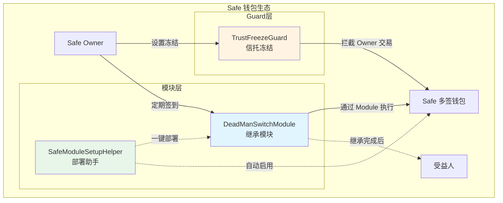

# FamilyKey Contract

<div align="center">

**去中心化加密资产继承的核心智能合约**

[](https://docs.soliditylang.org/)
[](https://book.getfoundry.sh/)
[](https://safe.global/)
[](https://zodiac.wiki/)
[](./LICENSE)

</div>

---

> **语言：** 中文 | [English](README.en.md)

---

## 📖 项目简介

FamilyKey Contract 是基于 Safe 多签钱包的去中心化资产继承解决方案，通过 Dead Man's Switch（死亡开关）机制和信托冻结功能，为加密资产提供安全、灵活的继承路径。

### 核心特性

- 🔄 **自动化继承流程**：心跳签到、过期检测、挑战期、所有权转移全链上自动化
- 🧩 **模块化架构**：基于 Zodiac 框架，遵循 Safe 生态标准
- 🛡️ **信托冻结功能**：通过 Guard 机制冻结 Owner 操作，同时保持模块正常运行
- ⚡ **一键部署**：通过 SafeModuleSetupHelper 在 Safe 创建时同步部署并启用模块
- 🔐 **多重安全保障**：挑战期保护、状态机约束、身份验证、权限隔离
- 🧪 **完善测试**：Foundry 测试覆盖完整继承场景与边界情况

### 适用场景

- **个人资产继承**：为个人加密资产设置受益人和继承规则
- **家族信托**：通过冻结功能实现长期信托锁定，同时保留紧急继承机制
- **企业资产管理**：为企业钱包设置多重继承路径和备份方案

---

## 🧱 架构设计



### 架构说明

1. **DeadManSwitchModule**：实现心跳检测和所有权转移逻辑
2. **SafeModuleSetupHelper**：通过 delegatecall 在 Safe 初始化时部署并启用模块
3. **TrustFreezeGuard**：冻结 Owner 发起的交易，但允许 Module 正常执行

**关键设计原则**：
- Module 通过 `execTransactionFromModule` 执行，绕过 Guard 检查
- Owner 通过 `execTransaction` 执行，受 Guard 限制
- 信托期内 Owner 无法操作，但继承功能正常运行

---

## 🧩 合约模块

### 核心合约

| 合约 | 说明 | 核心功能 | 文件 |
|------|------|----------|------|
| **DeadManSwitchModule** | Safe 继承模块，基于 Zodiac 框架 | `checkIn`, `startClaim`, `finalizeClaim`, `updateBeneficiary` | `src/DeadManSwitchModule.sol` |
| **SafeModuleSetupHelper** | 一键部署助手，减少 Gas 并简化部署流程 | `setupModuleForSafe` | `src/SafeModuleSetupHelper.sol` |
| **TrustFreezeGuard** | Safe Guard，冻结 Owner 操作 | `freezeUntil`, `isFrozen`, `checkTransaction` | `src/TrustFreezeGuard.sol` |

### 辅助合约

- `src/interfaces/ISafe.sol` - Safe 核心接口定义
- `src/interfaces/IModuleProxyFactory.sol` - Zodiac 工厂接口

---

## 🔄 继承流程

### 1. 基础继承流程（无冻结）

```
1️⃣ Owner 定期调用 checkIn() 保持心跳
   ↓
2️⃣ 超过 heartbeatInterval 未签到
   ↓
3️⃣ Beneficiary 调用 startClaim() 发起继承
   ↓
4️⃣ 挑战期（challengePeriod）开始
   ├─ Owner 可调用 checkIn() 取消继承
   └─ 挑战期结束后
       ↓
5️⃣ Beneficiary 调用 finalizeClaim()
   ↓
6️⃣ Safe 所有权转移给 Beneficiary ✅
```

### 2. 信托冻结场景

```
场景：Owner 希望设置 5 年信托期，期间无法操作资金

1️⃣ Safe 创建时启用 DeadManSwitch 模块
   ↓
2️⃣ Safe 设置 TrustFreezeGuard 并冻结 5 年
   freezeUntil(block.timestamp + 5 years)
   ↓
3️⃣ 冻结期间：
   ❌ Owner 无法通过 execTransaction 操作
   ✅ DeadManSwitch 模块仍可正常运行
   ↓
4️⃣ 如果 Owner 在冻结期内去世：
   - Beneficiary 发起继承 → 挑战期 → 完成继承
   - 通过 Module 执行，不受 Guard 限制
   ↓
5️⃣ 冻结期结束后：
   - Safe 自动解冻（如果未继承）
   - 或 Beneficiary 已成为新 Owner（如果已继承）
```

---

## ⚙️ 快速上手

### 安装依赖

```bash
# 克隆仓库
git clone https://github.com/your-org/familykey-contract.git
cd familykey-contract

# 安装依赖
forge install

# 编译合约
forge build

# 运行测试
forge test

# 查看覆盖率
forge coverage
```

### 部署合约

项目提供完整的部署脚本，支持分步部署：

```bash
# 1. 部署 DeadManSwitch 模块实现
forge script script/DeployDeadManSwitch.s.sol --rpc-url $RPC_URL --broadcast

# 2. 部署 Module Factory（如需）
forge script script/DeployFactory.s.sol --rpc-url $RPC_URL --broadcast

# 3. 部署 SafeModuleSetupHelper
forge script script/DeploySetupHelper.s.sol --rpc-url $RPC_URL --broadcast

# 4. 部署 TrustFreezeGuard
forge script script/DeployTrustFreezeGuard.s.sol --rpc-url $RPC_URL --broadcast
```

部署信息保存在 `deployments/` 目录，按网络和时间戳组织。

### 使用示例

#### 场景 1：创建带继承功能的 Safe

```solidity
// 使用 SafeModuleSetupHelper 在 Safe 创建时启用模块
// 通过 Safe.setup() 的 to 和 data 参数调用

address setupHelper = 0x...; // SafeModuleSetupHelper 地址
bytes memory setupData = abi.encodeWithSignature(
    "setupModuleForSafe(address,uint256,uint256,uint256)",
    beneficiary,        // 受益人地址
    90 days,            // 心跳间隔
    7 days,             // 挑战期
    saltNonce           // 部署盐
);

// 在 Safe 初始化时传入
Safe.setup(
    owners,
    threshold,
    setupHelper,        // to
    setupData,          // data
    fallbackHandler,
    paymentToken,
    payment,
    paymentReceiver
);
```

#### 场景 2：设置信托冻结

```solidity
// Owner 通过 Safe 多签执行以下交易

// 1. 设置 Guard
Safe.setGuard(trustFreezeGuardAddress);

// 2. 设置冻结期（5 年）
TrustFreezeGuard.freezeUntil(block.timestamp + 5 * 365 days);
```

详细使用指南请参考 [TrustFreezeGuard_USAGE.md](TrustFreezeGuard_USAGE.md)。

---

## 🧪 测试

### 测试覆盖

- **DeadManSwitchModule.t.sol**：模块初始化、心跳、继承流程、参数更新
- **TrustFreezeGuard.t.sol**：冻结管理、Guard 拦截、Module 绕过、完整信托场景

```bash
# 运行所有测试
forge test

# 运行特定测试并显示详细日志
forge test --match-contract DeadManSwitchModuleTest -vvv

# 运行 TrustFreezeGuard 测试
forge test --match-contract TrustFreezeGuardTest -vvv

# 查看 Gas 报告
forge test --gas-report
```

### 测试场景

- ✅ 正常继承流程（心跳 → 过期 → 继承）
- ✅ 挑战期内取消继承
- ✅ 参数动态更新（受益人、心跳间隔、挑战期）
- ✅ 信托冻结场景（Owner 冻结 + Module 继承）
- ✅ 多 Safe 独立运行
- ✅ 权限验证和边界情况
- ✅ 模糊测试（Fuzz testing）

---

## 🔐 安全实践

### 已实现的安全措施

1. **挑战期保护**：防止误触发或恶意继承，Owner 有时间撤回
2. **状态机约束**：严格的状态迁移，防止非法操作
3. **权限隔离**：Module 和 Guard 分层设计，职责清晰
4. **输入验证**：所有参数经过严格验证
5. **事件日志**：完整的事件记录，便于监控和审计
6. **Zodiac 兼容**：遵循 Safe 生态标准，可与其他 Zodiac 模块组合

### 风险提示

- ⚠️ **Guard 设置风险**：错误的 Guard 地址可能导致 Safe 永久锁定，请谨慎设置
- ⚠️ **长期冻结风险**：冻结期内 Owner 无法操作，请合理设置冻结时长
- ⚠️ **心跳维护**：Owner 需定期签到，否则可能触发继承流程
- ⚠️ **主网部署**：生产环境使用前务必完成专业审计

---

## 🛣️ 路线图

- [x] Safe 模块实现与测试
- [x] 信托冻结 Guard 实现与测试
- [x] 一键部署助手
- [x] Zodiac 框架集成
- [ ] 多受益人与比例分配
- [ ] 自动化心跳服务（链下）
- [ ] 前端 UI 集成
- [ ] 第三方安全审计
- [ ] 主网部署与生产验证

---

## 📚 相关资源

### 官方文档

- [Safe 文档](https://docs.safe.global/)
- [Zodiac 文档](https://zodiac.wiki/)
- [Safe Modules](https://docs.safe.global/advanced/smart-account-modules)
- [Safe Guards](https://docs.safe.global/advanced/smart-account-guards)

### 开发工具

- [Foundry Book](https://book.getfoundry.sh/)
- [Safe Contracts](https://github.com/safe-global/safe-contracts)
- [Zodiac Framework](https://github.com/gnosis/zodiac)

### 网络支持

- Ethereum Mainnet
- Base
- Optimism
- Arbitrum
- Polygon
- 及其他 EVM 兼容链

---

## 🤝 贡献指南

欢迎 Issue、Pull Request 与审计建议：

1. **报告问题**：描述清晰的复现步骤和预期行为
2. **提交代码**：
   - 运行 `forge fmt` 格式化代码
   - 运行 `forge test` 确保测试通过
   - 更新相关文档和注释
3. **安全建议**：如发现安全问题，请通过私密渠道联系我们

---

## 📄 许可证

- **DeadManSwitchModule, SafeModuleSetupHelper**: MIT License
- **TrustFreezeGuard**: LGPL-3.0-only（与 Safe Contracts 保持一致）

详见 [LICENSE](./LICENSE) 文件。

---

<div align="center">

**Built with ❤️ for resilient crypto inheritance**

[⬆ 回到顶部](#familykey-contract)

</div>
